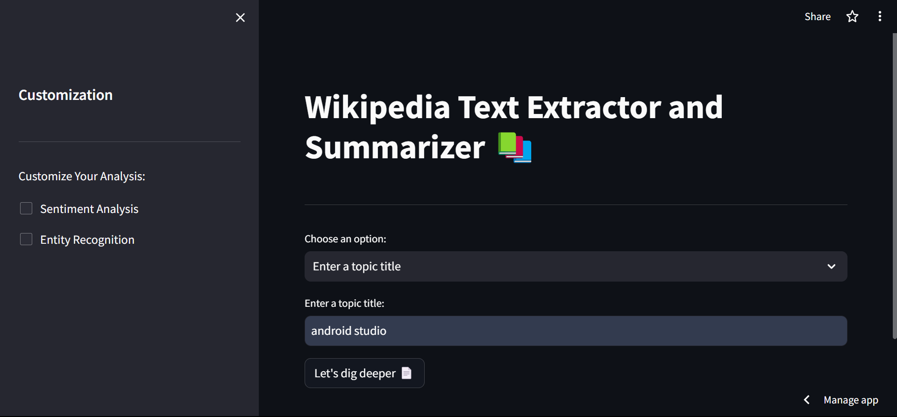
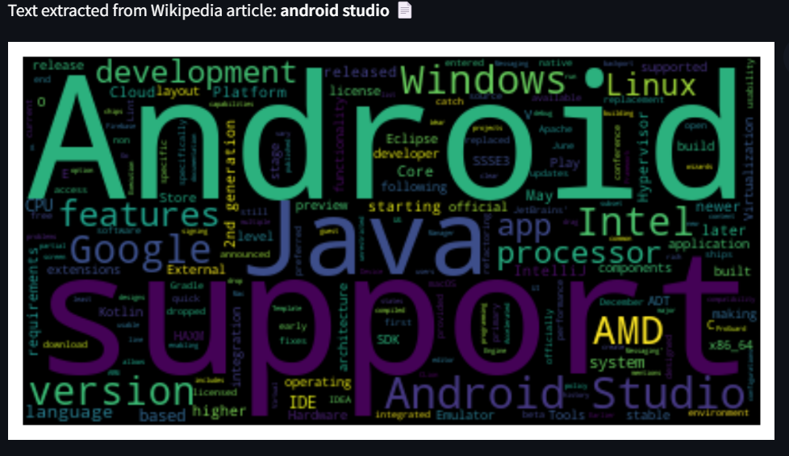
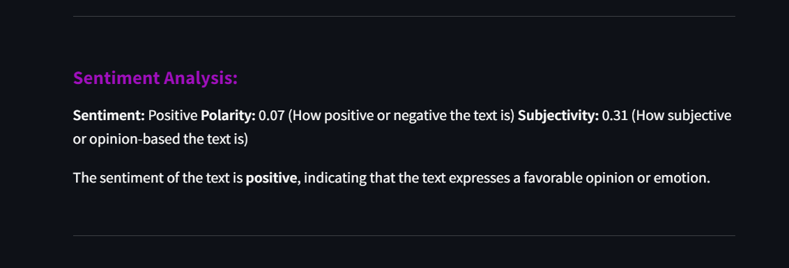
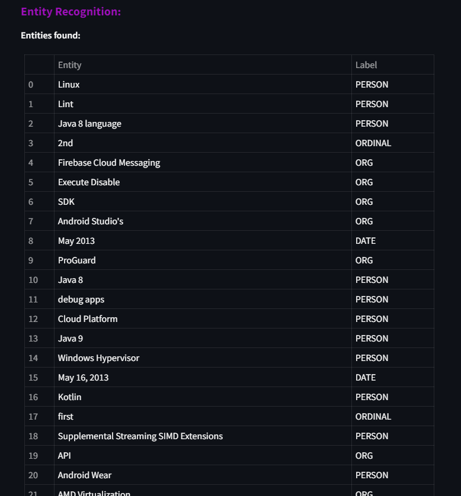

# Wikipedia Text Summarizer and Analysis 📚

This project is a Streamlit web application that extracts text from Wikipedia articles and provides summarization along with optional sentiment analysis and entity recognition.

## Features

- Extract text from Wikipedia articles by providing either a topic title or a Wikipedia page URL.
- Customize analysis with options for sentiment analysis and entity recognition.
- Display word cloud visualization of extracted text.
- Summarize the extracted text.
- Perform sentiment analysis on the extracted text (optional).
- Recognize entities in the text (optional).

## Usage

To run the application, make sure you have Python installed on your system along with the required dependencies listed in `requirements.txt`.

```bash
pip install -r requirements.txt
streamlit run app.py
```

The application will launch in your default web browser. You can then go ahead and interact with it using the provided user interface.

## Customization

The application offers customization options through the sidebar:

- **Choose an option:** Select whether you want to enter a topic title or a Wikipedia page URL.
- **Customize Your Analysis:** Toggle sentiment analysis and entity recognition options.

## Text Summarization

The BART model powers the text summarization module fine-tuned for summarization tasks. The `summarizer.py` module contains the code for generating text summaries.

## Utility Functions

The `utils.py` module contains utility functions used in the project:

- `write_word_cloud(text)`: Generates a word cloud visualization of the input text.
- `sentiment_report(text)`: Provides a sentiment analysis report for the input text.
- `get_entities(text)`: Recognizes entities in the input text.

## Wikipedia Text Extraction

The `wikipedia_extractor.py` module contains functions for extracting text from Wikipedia articles.

## Screenshots
- **GUI Interface:** This screenshot shows the graphical user interface (GUI) of the application, where users can interact with the various features and functionalities.
- 
- **Word Cloud Visualization:** This screenshot displays the word cloud visualization generated from the extracted text, providing a visual representation of the most frequently occurring words.
- 
- **Text Summary:** This screenshot presents the summarized version of the extracted text, allowing users to quickly grasp the key points and main ideas.
- 
- **Sentiment Analysis Report:** This screenshot exhibits the sentiment analysis report generated for the extracted text, indicating the overall sentiment (positive, negative, or neutral) and providing insights into the polarity and subjectivity.
- 
- **Named Entity Recognition (NER):** This screenshot showcases the named entity recognition (NER) results, highlighting and categorizing entities such as persons, organizations, locations, etc., identified within the text.
- 

Dependencies
------------

- [Streamlit](https://streamlit.io/)
- [spaCy](https://spacy.io/)
- [NLTK](https://www.nltk.org/)
- [matplotlib](https://matplotlib.org/)
- [wordcloud](https://github.com/amueller/word_cloud)
- [TextBlob](https://textblob.readthedocs.io/en/dev/)
- transformers

Author
------

[Moatasem Mohammed](https://github.com/moatasem75291)

